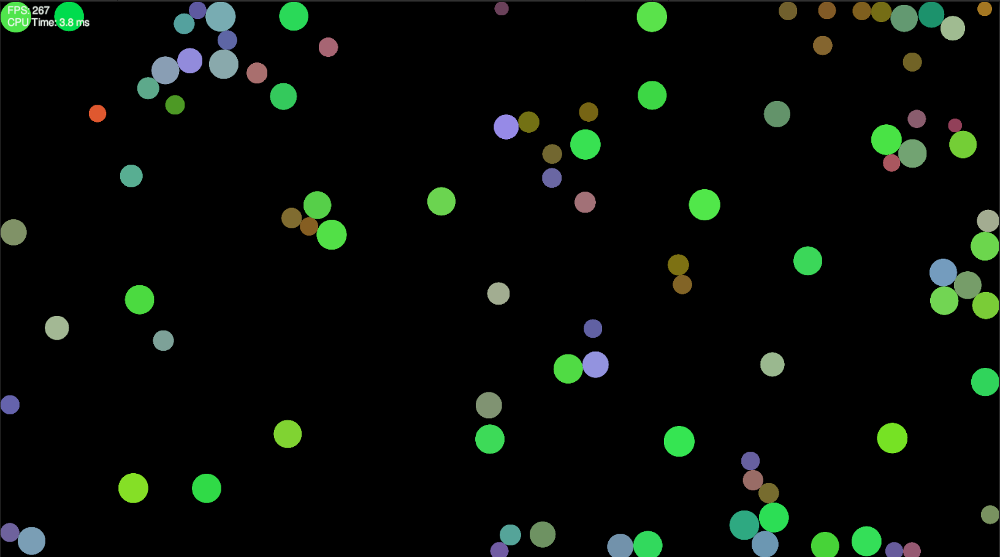

# Evosim


A basic evolutionary organism simulation built in Unity. Creatures are spawned into a 2D environment, where they move, perceive, and consume energy. Over time, more successful creatures (based on energy levels) reproduce through a simple evolutionary algorithm.

## 🎯 Purpose

This simulation demonstrates the basic principles of:
- Genetic variation and mutation
- Natural selection
- Neural network-driven behavior
- Survival of the fittest over generations

## 🧠 How It Works

- Creatures have DNA consisting of traits like speed, vision, size, metabolism, and a simple neural network.
- Creatures expend energy to move and gain energy by interacting with the environment (e.g., finding food).
- Once a generation dies, those that had high energy are selected as survivors.
- A new generation is created from mutated copies of survivors' DNA.
- If no survivors exist, a random generation is spawned.

## 🚀 Getting Started

### Requirements
- Unity 2021.3+ (or newer)
- 2D Project Template

### Installation
1. Clone the repository:
   ```bash
   git clone https://github.com/chouaibzaidali/EvolutionSim.git


## 📜 License

This project is licensed under the **[Creative Commons Attribution 4.0 International License (CC BY 4.0)](https://creativecommons.org/licenses/by/4.0/)**.

You are free to:
- **Share** – Copy, distribute, and transmit the work.
- **Adapt** – Remix, transform, and build upon the work.

**Under the following conditions**:
- **Attribution** – You must give appropriate credit, provide a link to the license, and indicate if changes were made. You may do so in any reasonable manner, but not in any way that suggests the licensor endorses you or your use.

